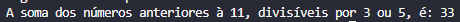

<h1 align="center">
    Instruções
</h1>

Basta clonar este repositório.

 
Instalar as dependências, utilizando o comando:
 
<pre><code>npm install</code></pre>
 
Rodar o projeto, utilizando o comando:
<pre><code>node .</code></pre>
 
Digitar um número inteiro positivo:
 

 

 
<h3 align="center">
    Testes
</h3>
 
Basta utilizar o comando, para alguns testes já escritos:
<pre><code>npm test</code></pre>